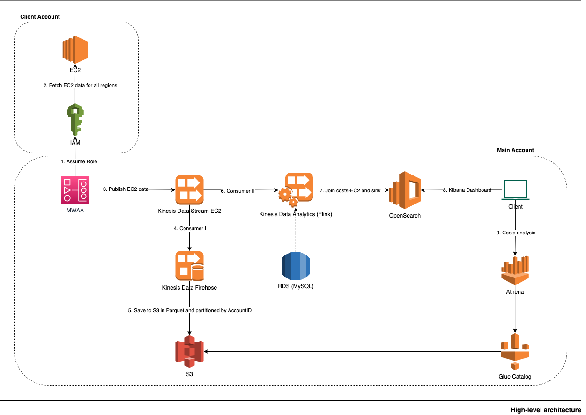
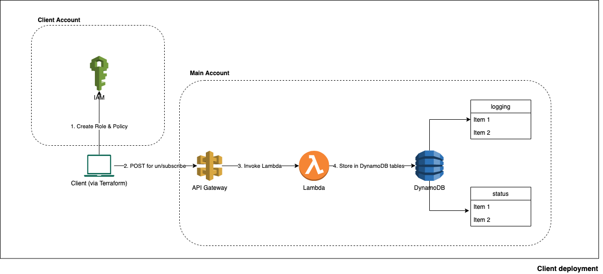
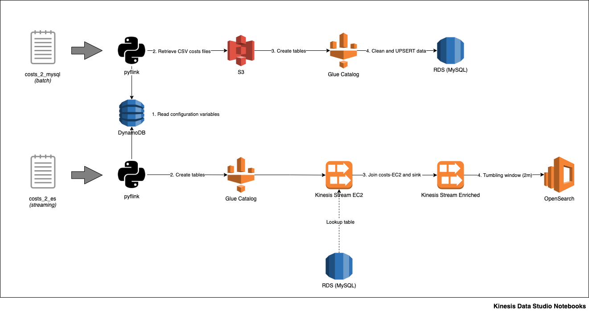

 
# Introduction
 
DoiT provides a [Cloud Management Platform (CMP)](https://help.doit-intl.com) at zero cost to our customers that unifies the costs from the major public cloud players (AWS, GCP and Azure) in a single unified view to assist in the financial control and costs optimization. One of the functionalities is to report to our customers when is found an anomaly in their costs so that they can react to it.
 
Currently, in AWS the [Costs and Usage Reports (CUR)](https://docs.aws.amazon.com/cur/latest/userguide/what-is-cur.html) is delivered in hourly-level granularity and appended multiple times a day to an S3 bucket. CUR data frequency is unpredictable can be delayed taking even up to two days to be available. This limits the possibility of reporting a customer on time via anomaly detection to prevent falling into significant unexpected costs.
 
In order to comply with the AWS Black Belt Data & Analytic track requirements, the participants need to show their hands-on skills by deploying a real-life example (preferably) using the best architectural principles to provide a performant, reliable, secure, scalable and cost-effective solution. With such requirements but also provide an impactful solution for our customers in the mid-term, it has been decided to implement a Proof-of-Concept solution (PoC) that can be used as a solid and extensible base to be modelled for further developments.
 
This solution focuses only on calculating the EC2 costs in near real-time (2 minutes window) since this is the most expensive asset used by our customers but is ready to be extended following the same approach to most of the services currently available in AWS.
 
The following image is a high-level overview of the solution. As it can be noticed, the EC2 data is gathered via MWAA (a DAG is dynamically created per AWS account), pushed to Kinesis Data Streams, joined with the EC2 costs and finally sink into ElasticSearch and accessible via Kibana for the data visualization, anomaly detection and alerting. In addition, the historical costs per account can be analyzed via Athena.
 

 
To extract the data from the AWS accounts, the client needs to create a role that can be assumed by the role used by MWAA. The following image shows the flow used and where the customer can subscribe/unsubscribe on his own using Terraform which will create a role and grant access via Trust relationship to the MWAA role and then report its availability by performing a POST via API Gateway which will record the action into DynamoDB.
 

 
These are the two core processes that run in Flink and are built using Kinesis Data Studio. The first one will gather the EC2 costs data for all the regions, perform some changes and upload the information into an RDS MySQL instance. The second process will join this data with the EC2 data streamed into Kinesis, push it into another Kinesis Data Stream, adjusted it into 2 minutes tumbling window and sink into ElasticSearch.
 

 
 
# Dependencies
 
The Git repositories related to this project are:
1. https://github.com/diavbolo/realtime-costs-client: required to un/subscribe AWS accounts
2. https://github.com/diavbolo/realtime-costs-airflow: required to scrape the EC2 data out from the AWS accounts
 
 
# Requirements
 
1. AWS account with AdministratorAccess rights
2. Docker: all the required software is encapsulated in a Docker image to ensure reproducibility and prevent conflicts
 
 
# Setup process
 
These are the steps that need to be followed:
1. (*AWS console > Route53*) Create a domain
2. Clone this repository to your computer
3. Rename `config.env.tpl` to `config.env` and adjust Terraform state variables to indicate the bucket, the file and the region where it needs to be stored
4. Adjust project variables in `variables.tf` paying attention to the comments
5. Initialize the system via `make init`
6. Deploy via `make apply`
7. (*Email*) Accept SNS email notification to start receiving them (specified [here](https://github.com/diavbolo/realtime-costs/blob/master/variables.tf#L32))
8. Follow the instructions described [here](https://github.com/diavbolo/realtime-costs-airflow) to deploy the DAGs
9. (*AWS console > CodePipeline > Settings > Connections*) Approve the  CodeStar connection to GitHub so that the CI/CD kicks off automatically on every merge in the master branch
10. (*AWS console > CodePipeline > Pipelines*) Select the pipeline and click on `Release change` or perform a `git add+commit+push` so that the DAGs are copied into the S3 bucket
11. (*Connect to the kibana_url as provided in the Terraform output*) Restore in Kibana the files available at `resources/kibana` (doesn't include alerts nor anomaly detection)
12. (*AWS console > Kinesis Data Studio*)
    * Select it and click on `Open in Apache Zeppelin`
    * Within Zeppelin, import the notebooks available at `resources/notebooks`
    * Edit `costs_2_mysql` and `costs_2_es` and adjust the variable `region_name` (required for Boto3)
    * Run `costs_2_mysql` and once completed do the same for `costs_2_es`
13. Follow the instructions described [here](https://github.com/diavbolo/realtime-costs-client) so that AWS accounts can join

In order to tear down the project, run the command `make destroy` 

# Pending
 
- Finish the Kinesis Streaming applications deployment (see *Known issues*)
 
 
# Well-architected followed principles
 
- Operational excellence:
   * Automation: IaC using Terraform - modules and providers versions are set to ensure consistency
   * CI/CD for MWAA DAGs
   * Assets accessibility via a custom FQDN
   * Assets tagging
   * Central configuration: all configuration parameters are stored in DynamoDB (used by MWAA and Kinesis Data Studio)
   * Central metadata cataloguing (via Glue) for S3, MySQL and Flink
- Performance/observability:
   * Monitoring via custom CloudWatch Dashboards
   * Alerting via email using SNS when DAG exceptions (via CloudWatch Logging), NULL costs or no data has been pushed (via OpenSearch)
- Security:
   * MFA (manually configured)
   * Secret Manager (no password in the code, random generation)
   * Encryption: in-transit and at-rest for most of services except S3 
   * CloudTrail
   * Only MWAA and OpenSearch are publicly accessible. All resources are deployed in private networks (Internet access via NAT Gateway)
   * Least privilege principle (via IAM)
- Reliability:
   * AWS Backup for DynamoDB tables and MySQL
   * S3 data bucket replication (with lifecycle rules on replica bucket)
- Costs/scalability: Kinesis and DynamoDB in on-demand capacity mode
 
 
# Further improvements
 
- Functional:
   * Subtract/recalculate costs for RIs (see [here](https://docs.aws.amazon.com/cli/latest/reference/ec2/describe-reserved-instances.html))
   * Remove duplicates in the publisher (continuous execution and detect changes compared to the previous batch)
   * Use CloudTrail would need to report about an EC2 change and gather the data
   * Calculate EBS costs
   * Perform an analysis over historical costs changes
   * Integrate OpenSearch with Cognito OAuth and restrict access via column level so that customers may say only their accounts
- Technical:
   * Check role assumption usage limits, and if needed, change to ECS Fargate with multi-role
   * Implement CI/CD for this repository (to avoid any drift and ensure the desired resource status)
   * Implement S3 server side encryption
   * Implement Lake Formation for Data Governance
   * Increase the HA with a multi-region setup
   * Add more CloudWatch alerts
   * Implement proper testing (unit, integration, end-to-end) and monitoring
 
 
# Known issues
 
- Kinesis Data Studio:
   * Kinesis Streaming applications: the Build+Deploy from Kinesis Data Studio works but the code doesn't run (AWS Support ticket #9461245371). Once fixed it is pending to:
       1. Schedule `costs_2_mysql` to be triggered once a day in MWAA
       2. In `costs_2_es`, sink the same data pushed to OpenSearch into S3 per account id (or alternatively from Kinesis Firehose)
   * Doesn't support JSON functions since it uses Flink v1.13.2 (it needs to be implemented via UDF)
   * Doesn't allow installing any pip modules (i.e. mysql, elasticsearch) and there's no shell interpreter
   * It can unexpectedly crash. In order to fix this, it needs to be stopped and started
   * Is not yet available in Terraform
- Kinesis Firehose: Dynamic Partitioning is not yet available in Terraform
- MWAA: requires boto3 == 1.8.0 provided via requirements.txt to be able to extract OS information from EC2 (a newer version would also work but MWAA fails)
- Lambda: the function used for the subscription mechanism cannot be tested by itself since it depends on the json.loads for the http POST in API Gateway
- OpenSearch: t2.micro and t2.small instances do not support anomaly detection
 
 
# References
 
https://toolbox.googleapps.com/apps/encode_decode \
https://stedolan.github.io/jq/manual \
https://jqplay.org/jq?q=fromdate&j=%222015-03-05T23%3A51%3A47Z%22 \
https://zjffdu.medium.com/flink-on-zeppelin-part-2-batch-711731df5ad9 \
https://zeppelin.apache.org/docs/0.9.0/interpreter/flink.html \
https://aws.amazon.com/blogs/big-data/top-10-flink-sql-queries-to-try-in-amazon-kinesis-data-analytics-studio \
https://github.com/ververica/sql-training/tree/master/slides \
https://stackoverflow.com/questions/69427941/how-write-to-s3-table-sink-in-flink-without-update-and-delete-changes-error \
https://automateinfra.com/2021/03/24/how-to-create-secrets-in-aws-secrets-manager-using-terraform-in-amazon-account \
https://stackoverflow.com/questions/58000751/using-aws-secrets-manager-with-python-lambda-console \
https://nightlies.apache.org/flink/flink-docs-master/docs/dev/python/table/intro_to_table_api \
https://technotrampoline.com/articles/how-to-add-email-subscribers-to-an-aws-sns-topic-with-terraform \
https://aws.amazon.com/blogs/big-data/setting-alerts-in-amazon-elasticsearch-service \
https://haydnjmorris.medium.com/solving-permissions-error-with-aws-codepipeline-c93cfc000285 \
https://stackoverflow.com/questions/46767947/aws-api-gateway-error-api-gateway-does-not-have-permission-to-assume-the-provid \
https://stackoverflow.com/questions/54835528/aws-api-gateway-and-lambda-function-deployed-through-terraform-execution-fail/54868502#54868502 \
https://aws.amazon.com/blogs/apn/use-amazon-opensearch-service-with-kibana-for-identity-federation-auth0 \
https://reelyactive.github.io/diy/kibana-timelion-receivers \
https://stackoverflow.com/questions/62222899/how-to-configure-alignment-and-indentation-of-terraform-code-inside-vs-code \
https://docs.aws.amazon.com/kinesisanalytics/latest/java/how-zeppelin-troubleshooting.html \
https://pricing.us-east-1.amazonaws.com/offers/v1.0/aws/index.json \
https://dev.betterdoc.org/infrastructure/2020/02/04/setting-up-a-nat-gateway-on-aws-using-terraform.html \
https://aws.amazon.com/architecture/well-architected \
https://netwerk.io/terraform-s3-redirects \
https://aws.amazon.com/premiumsupport/knowledge-center/cloudwatch-receive-sns-for-alarm-trigger
